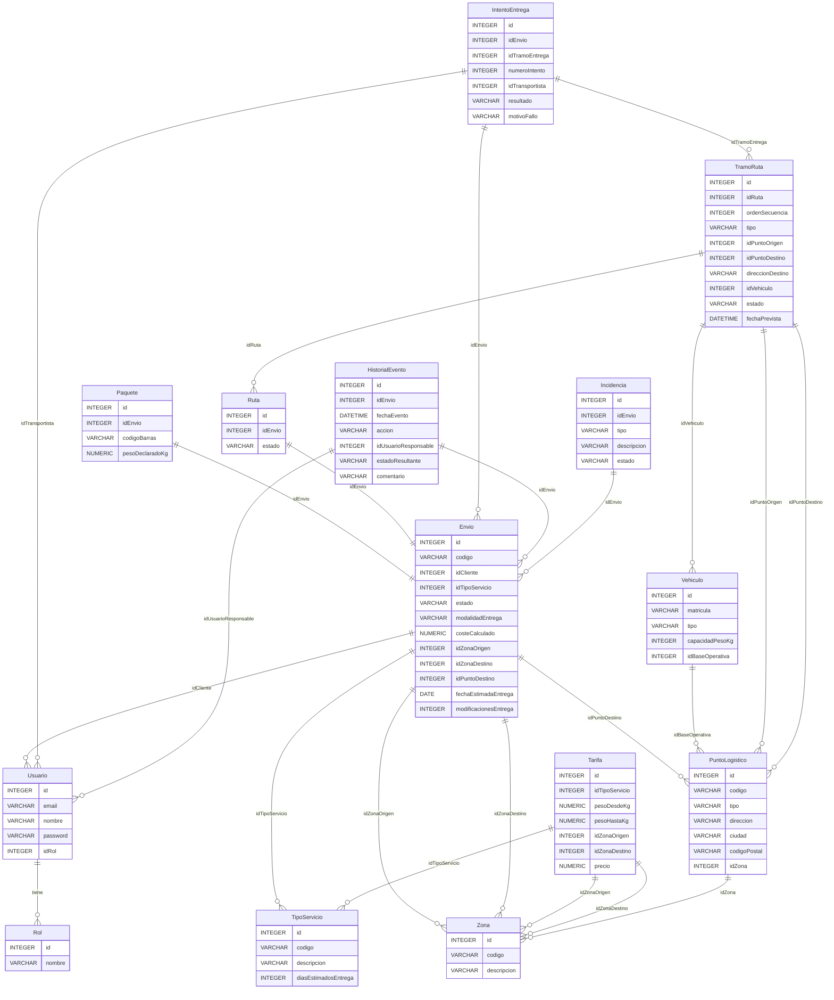

[](https://github.com/javiertuya/samples-test-dev/actions/workflows/test.yml)

# SI2025-PL32 — Sistema de Transporte de Paquetes

Trabajo práctico de la asignatura **Sistemas de Información** (Ingeniería Informática, Universidad de Oviedo) — convocatoria de **junio 2026**.

El sistema gestiona el ciclo completo de un envío de paquetería: registro en oficina, asignación automática de rutas y vehículos, verificación en almacenes, seguimiento por el cliente, modificación del lugar de entrega y gestión de entregas fallidas con reintentos.

## Historias de usuario implementadas

| HU | Título | Rol principal |
|----|--------|--------------|
| HU-01 | Registro de envío desde oficina | Empleado de oficina |
| HU-02 | Asignación automática de ruta y vehículos | Sistema (automático) |
| HU-03 | Verificación de carga y descarga en almacén | Operario de almacén |
| HU-04 | Seguimiento de envío por el cliente | Cliente |
| HU-05 | Modificación del lugar de entrega | Cliente |
| HU-06 | Gestión de entregas fallidas y reintentos | Transportista |

## Stack técnico

- **Java 17** + **Maven**
- **SQLite** (`sqlite-jdbc` + Apache Commons DbUtils) — base de datos local `DemoDB.db`
- **Swing** + **MigLayout** + **LGoodDatePicker** para la interfaz gráfica
- **JUnit 5** + **JaCoCo** para tests y cobertura
- **SLF4J** + reload4j para logging
- Patrón **MVC** (Modelo / Vista / Controlador) + DTOs

## Estructura de paquetes

```
src/main/java/
  giis.demo.tkrun.paqueteria.envios       HU-01: registro de envíos
  giis.demo.tkrun.paqueteria.rutas        HU-02: asignación de rutas
  giis.demo.tkrun.paqueteria.almacen      HU-03: carga/descarga en almacén
  giis.demo.tkrun.paqueteria.seguimiento  HU-04 y HU-05: seguimiento y modificación
  giis.demo.tkrun.paqueteria.entregas     HU-06: entregas y reintentos
  giis.demo.tkrun.paqueteria.login        Login, sesión y menú principal
  giis.demo.tkrun.paqueteria.util         Utilidades comunes del dominio
  giis.demo.util                          Utilidades de la plantilla (DB, Swing, etc.)

src/test/java/
  giis.demo.tkrun.paqueteria.rutas        Tests HU-02 (AsignacionRutaServiceTest)
  giis.demo.tkrun.paqueteria.almacen      Tests HU-03 (AlmacenModelTest)
  giis.demo.tkrun.paqueteria.entregas     Tests HU-06 (EntregasModelTest)
```

La estructura de directorios sigue el estándar de Maven:
- `src/main/java`: Código fuente de la aplicación
- `src/main/resources`: Scripts SQL (`schema.sql`, `data.sql`) y `application.properties`
- `src/test/java`: Pruebas unitarias
- `target`: Generado con el código objeto y reports

## Requisitos e instalación

Este proyecto requiere un mínimo de **Java 17 JDK**.

1. Clonar el repositorio:
   ```
   git clone <url-del-repositorio>
   ```
2. Importar en Eclipse como proyecto Maven existente (*File → Import → Existing Maven Projects*)
3. *Maven → Update Project* para descargar dependencias
4. Verificar que el JDK configurado sea Java 17: en *Build Path → JRE System Library*, comprobar que JavaSE-17 apunta a un JDK

## Ejecución

**Desde Eclipse:**

- Ejecutar la aplicación: clase principal `giis.demo.util.SwingMain`
  - Pulsar **"Inicializar BD"** y **"Cargar Datos"** antes del primer uso para crear y poblar la base de datos
- Ejecutar los tests: botón derecho sobre cualquier clase de test → *Run As → JUnit Test*

**Desde línea de comandos** (requiere [Apache Maven](https://maven.apache.org/download.cgi) en el PATH):
```
mvn test          # solo pruebas unitarias
mvn install       # compilación completa + pruebas + javadoc
```

## Usuarios de prueba

La base de datos de prueba incluye los siguientes usuarios (contraseña `1234` para todos):

| Usuario | Rol | Identificador en el combo |
|---------|-----|--------------------------|
| Ana López | Empleado | `Ana López — OF-GIJ-01 (empleado)` |
| Luis Gómez | Operario | `Luis Gómez — AL-CTRO-01 (operario)` |
| Carlos Ruiz | Transportista | `Carlos Ruiz — vehiculo 1234-AAA (transportista)` |
| Javier Martín | Transportista | `Javier Martín — vehiculo 7890-EEE (transportista)` |
| María Pérez | Cliente | `María Pérez — DNI 44444444E (cliente)` |
| Pedro Sánchez | Cliente | `Pedro Sánchez — DNI 55555555F (cliente)` |

## Códigos de barras para pruebas (HU-03)

El operario Luis Gómez trabaja en el almacén **AL-CTRO-01**:

| Operación | Código de barras | Envío | Peso declarado |
|-----------|-----------------|-------|----------------|
| ENTRADA | `BC-20260601-0001-X` | ENV-20260601-0001 | 3,5 kg |
| SALIDA | `BC-20260530-0002-Y` | ENV-20260530-0002 | 1,8 kg |

## Reports

Tras ejecutar `mvn install`, los reports quedan en `target`:
- `reports/surefire.html`: report de las pruebas unitarias
- `site/jacoco-ut`: cobertura de código

## Esquema de base de datos


